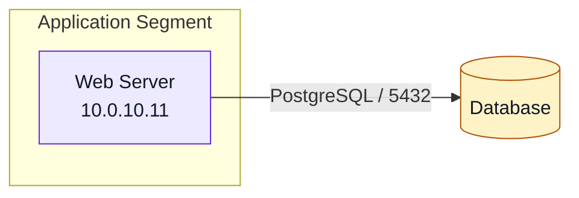

# Network Diagram Harness

ネットワーク・サーバ構成図を、構造化されたインフラ定義から生成するためのハーネスです。

このリポジトリでは、手作業の作図ではなく、Git 管理できる定義ファイルを入力にして、再生成可能な構成図を出力することを目的にします。

## Goal

- ネットワーク・サーバ構成を YAML で定義する
- 定義ファイルから Mermaid の構成図を生成する
- 将来的に SVG/PNG/draw.io/PlantUML などへ出力を拡張する
- 構成図の更新漏れや表記ゆれを減らす

## MVP Scope

最初の MVP では、以下に絞ります。

- 入力形式: YAML
- 出力形式: Mermaid flowchart
- 対象要素:
  - network
  - subnet
  - server
  - database
  - load_balancer
  - firewall
  - external
- 接続情報:
  - source
  - target
  - label
  - protocol
  - port
  - purpose
- グルーピング:
  - zones

## Repository Layout

フォルダ構造と各ディレクトリの役割は [docs/folder-structure.md](docs/folder-structure.md) にまとめています。

## Public And Private Data

このリポジトリは、将来的に GitHub へ公開できるように、ハーネス本体と公開可能な架空サンプルだけを管理対象にします。

実際のネットワーク構成、サーバ名、実 IP アドレス、VPN/Firewall/VLAN/subnet の実設計、社内ドメイン、クラウド account ID などは、この公開リポジトリには入れません。

ローカルで実構成を試す場合は、Git 管理外の `private/` や `local/` に置きます。

```text
private/
  actual-network.yml

local/
  sandbox-network.yml
```

公開用のサンプルは `examples/` に置き、実構成に見えない架空データだけを使います。

## Usage

依存関係をインストールします。

```powershell
python -m venv .venv
.\.venv\Scripts\Activate.ps1
pip install -e ".[test]"
```

サンプル定義を検証します。

```powershell
network-diagram-harness validate examples/simple-network.yml
```

Mermaid を生成します。

```powershell
network-diagram-harness render examples/simple-network.yml --output output/simple-network.mmd
```

Markdown プレビューを生成します。

```powershell
network-diagram-harness preview examples/web-three-tier.yml --output output/web-three-tier.md
```

Mermaid CLI が入っている環境では SVG/PNG/PDF へ export できます。

```powershell
network-diagram-harness export examples/web-three-tier.yml --output output/web-three-tier.svg
```

## Examples

公開用の架空サンプルを `examples/` に置いています。

| File | Purpose |
| --- | --- |
| `examples/simple-network.yml` | 最小の接続関係 |
| `examples/web-three-tier.yml` | Internet / DMZ / App / DB の three-tier 構成 |
| `examples/multi-zone-network.yml` | Edge, DMZ, App, Data, Observability を含む複数 zone 構成 |
| `examples/office-and-cloud.yml` | Office network と cloud segment の接続例 |
| `examples/profile-home-lab.yml` | 経歴ページ掲載向けに抽象化した home lab 構成 |
| `examples/zero-trust-access.yml` | Identity layer と access gateway を含む zero trust 例 |

Markdown プレビューは `docs/examples/` に生成済みです。

## Example

入力:

```yaml
zones:
  - id: app
    name: Application Segment

nodes:
  - id: web
    name: Web Server
    type: server
    zone: app
    ip: 10.0.10.11
  - id: db
    name: Database
    type: database

connections:
  - source: web
    target: db
    protocol: PostgreSQL
    port: 5432
```

出力:



## Direction

このハーネスは、単なる描画補助ではなく、構成情報を中心にした図面生成基盤として育てます。

優先する拡張候補:

- サブネットや DMZ などのグルーピング
- Mermaid 以外の出力形式
- IP アドレス、ポート、プロトコルの検証
- 図面ルールの lint
- CI での構成図再生成チェック

## Validation

現時点では、YAML 読み込み時に基本的な validation を行います。

- node / zone / connection の参照整合性
- `direction`, `node.type`, `connection.direction` の許可値
- `node.ip` の IP アドレス形式
- `connection.port` の範囲
- `connection.protocol` の文字列形式

テストでは `examples/` 配下の YAML が全て有効であることと、公開サンプルに実 IP らしい値が混ざらないことも確認します。

## CLI Commands

| Command | Description |
| --- | --- |
| `render` | YAML から Mermaid を生成します。 |
| `validate` | YAML の validation のみ実行します。 |
| `preview` | Mermaid code block を埋め込んだ Markdown を生成します。 |
| `export` | Mermaid CLI を使って SVG/PNG/PDF を生成します。 |
| `export-all` | ディレクトリ配下の `*.yml` をまとめて画像化します。 |

後方互換のため、`network-diagram-harness examples/simple-network.yml` も `render` と同じ動作をします。

`export` には Mermaid CLI の `mmdc` が必要です。未導入の場合は `render` または `preview` を使って Mermaid を確認できます。

画像出力の運用手順は [docs/image-export-workflow.md](docs/image-export-workflow.md) にまとめています。

自宅ネットワーク構成図を自分向けと公開向けに分けて育てる手順は [docs/profile-network-workflow.md](docs/profile-network-workflow.md) にまとめています。

自宅ネットワーク構成図の自分向け・公開向け画像をまとめて更新する場合:

```powershell
.\scripts\export-profile-images.ps1
```

## Preview Document

現在の設定と Mermaid プレビューは [docs/current-state.md](docs/current-state.md) にまとめています。

## Specification

全体仕様は [docs/specification.md](docs/specification.md) にまとめています。

## Schema

YAML 仕様は [docs/schema.md](docs/schema.md) にまとめています。

## Prompt Workflow

Codex に自然文で構成を伝えて YAML 化、検証、Preview 生成まで行う運用手順は [docs/prompt-workflow.md](docs/prompt-workflow.md) にまとめています。

依頼用テンプレートは [prompts/network-diagram-request.md](prompts/network-diagram-request.md) にあります。
