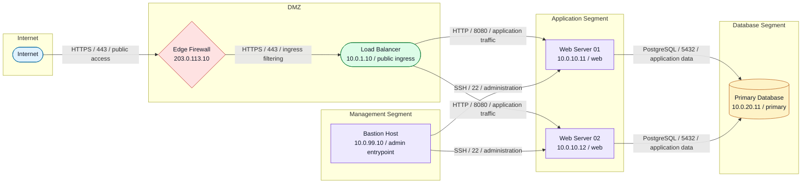

# Current State

このドキュメントは、現時点のハーネス設定とサンプル構成図を確認するための簡易プレビューです。

GitHub や Mermaid 対応の Markdown viewer では、下部の `mermaid` ブロックが図として表示されます。画像出力を作る前の確認用として使います。

## Harness Settings

| Item | Current Value |
| --- | --- |
| Project name | `network-diagram-harness` |
| Version | `0.1.0` |
| Python | `>=3.10` |
| Dependency | `PyYAML>=6.0` |
| Test dependency | `pytest>=8.0` |
| Input format | `YAML` |
| Current output format | `Mermaid flowchart` |
| CLI command | `network-diagram-harness` |

## Public Repository Policy

このリポジトリは、将来的な GitHub 公開を前提にします。

管理対象に入れるもの:

- ハーネス本体のコード
- テスト
- ドキュメント
- 架空のサンプル構成
- 公開してよい Mermaid プレビュー

管理対象に入れないもの:

- 実サーバ名
- 実ホスト名
- 実 IP アドレス
- VPN / Firewall / VLAN / subnet の実設計
- 社内ドメイン
- クラウド account ID / project ID / resource ID
- 実運用経路を含む構成図
- 実構成から生成した `output/`

実構成をローカルで扱う場合は、Git 管理外の `private/` または `local/` に置きます。

```text
private/
  actual-network.yml

local/
  sandbox-network.yml
```

## Current Schema

詳細な YAML 仕様は [schema.md](schema.md) にまとめています。

```yaml
title: string
direction: LR | RL | TB | TD | BT

zones:
  - id: string
    name: string
    description: string

nodes:
  - id: string
    name: string
    type: external | firewall | load_balancer | server | database | network | subnet
    zone: string
    ip: string
    role: string
    environment: string
    description: string

connections:
  - source: string
    target: string
    label: string
    protocol: string
    port: number | string
    purpose: string
    direction: outbound | inbound | bidirectional
```

`label` は後方互換用です。`label` がない場合は `protocol`, `port`, `purpose` から Mermaid の接続ラベルを生成します。

## Supported Node Types

| Type | Intended Meaning |
| --- | --- |
| `external` | Internet や外部サービス |
| `firewall` | Firewall や境界制御 |
| `load_balancer` | Load balancer |
| `server` | Application server や汎用 server |
| `database` | Database |
| `network` | Network boundary |
| `subnet` | Subnet や segment |

## Public Examples

| File | Purpose |
| --- | --- |
| `examples/simple-network.yml` | 最小の接続関係 |
| `examples/web-three-tier.yml` | Internet / DMZ / App / DB の three-tier 構成 |
| `examples/multi-zone-network.yml` | Edge, DMZ, App, Data, Observability を含む複数 zone 構成 |
| `examples/office-and-cloud.yml` | Office network と cloud segment の接続例 |
| `examples/zero-trust-access.yml` | Identity layer と access gateway を含む zero trust 例 |

各サンプルの Markdown プレビューは `docs/examples/` にあります。

## Prompt Workflow

Codex に自然文で構成を伝えてハーネスを動かす運用手順は [prompt-workflow.md](prompt-workflow.md) にあります。

## Folder Structure

フォルダ構造と各ディレクトリの役割は [folder-structure.md](folder-structure.md) にあります。

## Specification

全体仕様は [specification.md](specification.md) にあります。

## Current Example Input

Source: `examples/web-three-tier.yml`

```yaml
title: Web Three Tier Network
direction: LR

zones:
  - id: internet
    name: Internet

  - id: dmz
    name: DMZ
    description: Public-facing network segment.

  - id: app
    name: Application Segment

  - id: db
    name: Database Segment

  - id: management
    name: Management Segment

nodes:
  - id: internet
    name: Internet
    type: external
    zone: internet

  - id: fw01
    name: Edge Firewall
    type: firewall
    zone: dmz
    ip: 203.0.113.10

  - id: lb01
    name: Load Balancer
    type: load_balancer
    zone: dmz
    ip: 10.0.1.10
    role: public ingress

  - id: web01
    name: Web Server 01
    type: server
    zone: app
    ip: 10.0.10.11
    role: web
    environment: production

  - id: web02
    name: Web Server 02
    type: server
    zone: app
    ip: 10.0.10.12
    role: web
    environment: production

  - id: db01
    name: Primary Database
    type: database
    zone: db
    ip: 10.0.20.11
    role: primary
    environment: production

  - id: bastion01
    name: Bastion Host
    type: server
    zone: management
    ip: 10.0.99.10
    role: admin entrypoint

connections:
  - source: internet
    target: fw01
    protocol: HTTPS
    port: 443
    purpose: public access

  - source: fw01
    target: lb01
    protocol: HTTPS
    port: 443
    purpose: ingress filtering

  - source: lb01
    target: web01
    protocol: HTTP
    port: 8080
    purpose: application traffic

  - source: lb01
    target: web02
    protocol: HTTP
    port: 8080
    purpose: application traffic

  - source: web01
    target: db01
    protocol: PostgreSQL
    port: 5432
    purpose: application data

  - source: web02
    target: db01
    protocol: PostgreSQL
    port: 5432
    purpose: application data

  - source: bastion01
    target: web01
    protocol: SSH
    port: 22
    purpose: administration

  - source: bastion01
    target: web02
    protocol: SSH
    port: 22
    purpose: administration
```

## Generate Preview

```powershell
.\.venv\Scripts\network-diagram-harness.exe preview examples/web-three-tier.yml
```

ファイルへ出力する場合:

```powershell
.\.venv\Scripts\network-diagram-harness.exe preview examples/web-three-tier.yml --output output/web-three-tier.md
```

Mermaid のみを出力する場合:

```powershell
.\.venv\Scripts\network-diagram-harness.exe render examples/web-three-tier.yml --output output/web-three-tier.mmd
```

Mermaid CLI が入っている環境で画像出力する場合:

```powershell
.\.venv\Scripts\network-diagram-harness.exe export examples/web-three-tier.yml --output output/web-three-tier.svg
```

複数 YAML をまとめて画像出力する場合:

```powershell
.\.venv\Scripts\network-diagram-harness.exe export-all examples --output-dir output/images --format svg
```

画像出力の詳しい運用は [image-export-workflow.md](image-export-workflow.md) にあります。

## Mermaid Preview



## Current Validation Rules

- `direction` は Mermaid の `TB`, `TD`, `BT`, `RL`, `LR` のみ許可
- `zone.id` の重複はエラー
- `node.id` の重複はエラー
- `node.zone` は既存 `zone.id` のみ許可
- `node.type` は定義済み type のみ許可
- `node.ip` は有効な IP アドレスのみ許可
- `connection.source` と `connection.target` は既存 `node.id` のみ許可
- `connection.port` は `1` から `65535` の数値、または `1000-2000` のような範囲のみ許可
- `connection.protocol` は英字から始まる protocol 文字列のみ許可
- `connection.direction` は `outbound`, `inbound`, `bidirectional` のみ許可
- `examples/` 配下の YAML は全て parse 可能であることをテスト
- `examples/` 配下の IP アドレスは public-looking な実 IP を避けることをテスト
- `node.name` が未指定の場合は `node.id` を表示名として使う
- `node.type` が未指定の場合は `server` として扱う
- Mermaid 出力では使用された `node.type` ごとに `classDef` と `class` を出力
