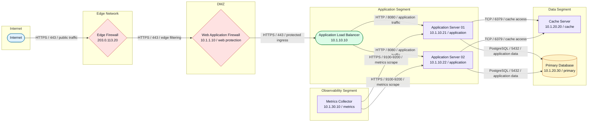

# Multi Zone Network

## Source

`examples/multi-zone-network.yml`

## Summary

- Zones: `6`
- Nodes: `9`
- Connections: `11`

## Mermaid Preview

```mermaid
flowchart LR
  %% Multi Zone Network
  subgraph zone_internet["Internet"]
    internet(["Internet"])
  end
  subgraph zone_edge["Edge Network"]
    edge_fw{"Edge Firewall<br/>203.0.113.20"}
  end
  subgraph zone_dmz["DMZ"]
    waf01{"Web Application Firewall<br/>10.1.1.10 / web protection"}
  end
  subgraph zone_app["Application Segment"]
    app_lb(["Application Load Balancer<br/>10.1.10.10"])
    app01["Application Server 01<br/>10.1.10.21 / application"]
    app02["Application Server 02<br/>10.1.10.22 / application"]
  end
  subgraph zone_data["Data Segment"]
    cache01["Cache Server<br/>10.1.20.20 / cache"]
    db01[("Primary Database<br/>10.1.20.30 / primary")]
  end
  subgraph zone_observability["Observability Segment"]
    metrics01["Metrics Collector<br/>10.1.30.10 / metrics"]
  end
  internet -->|"HTTPS / 443 / public traffic"| edge_fw
  edge_fw -->|"HTTPS / 443 / edge filtering"| waf01
  waf01 -->|"HTTPS / 443 / protected ingress"| app_lb
  app_lb -->|"HTTP / 8080 / application traffic"| app01
  app_lb -->|"HTTP / 8080 / application traffic"| app02
  app01 -->|"TCP / 6379 / cache access"| cache01
  app02 -->|"TCP / 6379 / cache access"| cache01
  app01 -->|"PostgreSQL / 5432 / application data"| db01
  app02 -->|"PostgreSQL / 5432 / application data"| db01
  metrics01 -->|"HTTPS / 9100-9200 / metrics scrape"| app01
  metrics01 -->|"HTTPS / 9100-9200 / metrics scrape"| app02
  classDef type_database fill:#fef3c7,stroke:#b45309,color:#111827
  classDef type_external fill:#e0f2fe,stroke:#0369a1,color:#111827
  classDef type_firewall fill:#fee2e2,stroke:#b91c1c,color:#111827
  classDef type_load_balancer fill:#dcfce7,stroke:#15803d,color:#111827
  classDef type_server fill:#ede9fe,stroke:#6d28d9,color:#111827
  class db01 type_database
  class internet type_external
  class edge_fw,waf01 type_firewall
  class app_lb type_load_balancer
  class app01,app02,cache01,metrics01 type_server
```
