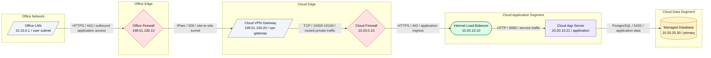

# Office And Cloud Network

## Source

`examples/office-and-cloud.yml`

## Summary

- Zones: `5`
- Nodes: `7`
- Connections: `6`

## Mermaid Preview

```mermaid
flowchart LR
  %% Office And Cloud Network
  subgraph zone_office["Office Network"]
    office_lan[/"Office LAN<br/>10.10.0.1 / user subnet" /]
  end
  subgraph zone_edge["Office Edge"]
    office_fw{"Office Firewall<br/>198.51.100.10"}
  end
  subgraph zone_cloud_edge["Cloud Edge"]
    cloud_vpn[/"Cloud VPN Gateway<br/>198.51.100.20 / vpn gateway" /]
    cloud_fw{"Cloud Firewall<br/>10.20.0.10"}
  end
  subgraph zone_cloud_app["Cloud Application Segment"]
    internal_lb(["Internal Load Balancer<br/>10.20.10.10"])
    app01["Cloud App Server<br/>10.20.10.21 / application"]
  end
  subgraph zone_cloud_data["Cloud Data Segment"]
    db01[("Managed Database<br/>10.20.20.30 / primary")]
  end
  office_lan -->|"HTTPS / 443 / outbound application access"| office_fw
  office_fw -->|"IPsec / 500 / site-to-site tunnel"| cloud_vpn
  cloud_vpn -->|"TCP / 10000-10100 / routed private traffic"| cloud_fw
  cloud_fw -->|"HTTPS / 443 / application ingress"| internal_lb
  internal_lb -->|"HTTP / 8080 / service traffic"| app01
  app01 -->|"PostgreSQL / 5432 / application data"| db01
  classDef type_database fill:#fef3c7,stroke:#b45309,color:#111827
  classDef type_firewall fill:#fee2e2,stroke:#b91c1c,color:#111827
  classDef type_load_balancer fill:#dcfce7,stroke:#15803d,color:#111827
  classDef type_network fill:#f1f5f9,stroke:#475569,color:#111827
  classDef type_server fill:#ede9fe,stroke:#6d28d9,color:#111827
  class db01 type_database
  class office_fw,cloud_fw type_firewall
  class internal_lb type_load_balancer
  class office_lan,cloud_vpn type_network
  class app01 type_server
```
