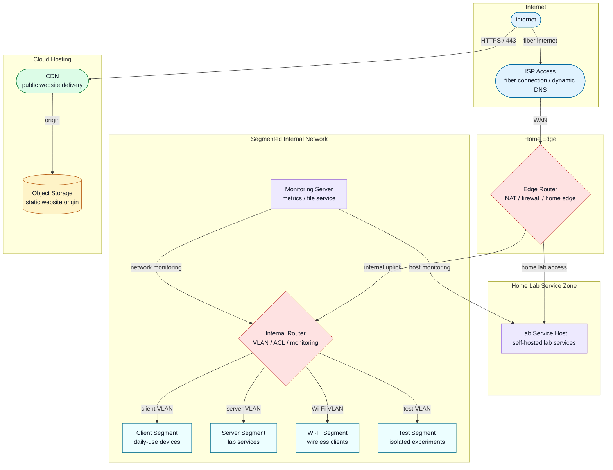

# Profile Home Lab Network

## Source

`examples/profile-home-lab.yml`

## Summary

- Zones: `5`
- Nodes: `12`
- Connections: `12`

## Mermaid Preview

```mermaid
flowchart TB
  %% Profile Home Lab Network
  subgraph zone_internet["Internet"]
    internet(["Internet"])
    isp_edge(["ISP Access<br/>fiber connection / dynamic DNS"])
  end
  subgraph zone_home_edge["Home Edge"]
    edge_router{"Edge Router<br/>NAT / firewall / home edge"}
  end
  subgraph zone_dmz["Home Lab Service Zone"]
    lab_service_host["Lab Service Host<br/>self-hosted lab services"]
  end
  subgraph zone_internal["Segmented Internal Network"]
    internal_router{"Internal Router<br/>VLAN / ACL / monitoring"}
    client_segment["Client Segment<br/>daily-use devices"]
    server_segment["Server Segment<br/>lab services"]
    wifi_segment["Wi-Fi Segment<br/>wireless clients"]
    test_segment["Test Segment<br/>isolated experiments"]
    monitoring_server["Monitoring Server<br/>metrics / file service"]
  end
  subgraph zone_cloud["Cloud Hosting"]
    cdn(["CDN<br/>public website delivery"])
    object_storage[("Object Storage<br/>static website origin")]
  end
  internet -->|"fiber internet"| isp_edge
  isp_edge -->|"WAN"| edge_router
  edge_router -->|"home lab access"| lab_service_host
  edge_router -->|"internal uplink"| internal_router
  internal_router -->|"client VLAN"| client_segment
  internal_router -->|"server VLAN"| server_segment
  internal_router -->|"Wi-Fi VLAN"| wifi_segment
  internal_router -->|"test VLAN"| test_segment
  monitoring_server -->|"network monitoring"| internal_router
  monitoring_server -->|"host monitoring"| lab_service_host
  internet -->|"HTTPS / 443"| cdn
  cdn -->|"origin"| object_storage
  classDef type_database fill:#fef3c7,stroke:#b45309,color:#111827
  classDef type_external fill:#e0f2fe,stroke:#0369a1,color:#111827
  classDef type_firewall fill:#fee2e2,stroke:#b91c1c,color:#111827
  classDef type_load_balancer fill:#dcfce7,stroke:#15803d,color:#111827
  classDef type_server fill:#ede9fe,stroke:#6d28d9,color:#111827
  classDef type_subnet fill:#ecfeff,stroke:#0e7490,color:#111827
  class object_storage type_database
  class internet,isp_edge type_external
  class edge_router,internal_router type_firewall
  class cdn type_load_balancer
  class lab_service_host,monitoring_server type_server
  class client_segment,server_segment,wifi_segment,test_segment type_subnet
```
