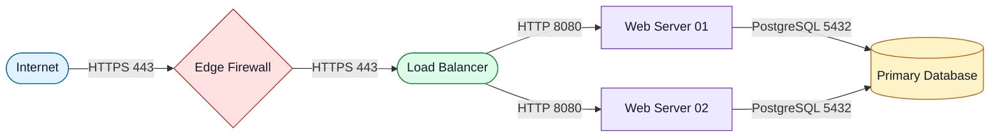

# Simple Network

## Source

`examples/simple-network.yml`

## Summary

- Zones: `0`
- Nodes: `6`
- Connections: `6`

## Mermaid Preview

```mermaid
flowchart LR
  %% Simple Network
  internet(["Internet"])
  fw01{"Edge Firewall"}
  lb01(["Load Balancer"])
  web01["Web Server 01"]
  web02["Web Server 02"]
  db01[("Primary Database")]
  internet -->|"HTTPS 443"| fw01
  fw01 -->|"HTTPS 443"| lb01
  lb01 -->|"HTTP 8080"| web01
  lb01 -->|"HTTP 8080"| web02
  web01 -->|"PostgreSQL 5432"| db01
  web02 -->|"PostgreSQL 5432"| db01
  classDef type_database fill:#fef3c7,stroke:#b45309,color:#111827
  classDef type_external fill:#e0f2fe,stroke:#0369a1,color:#111827
  classDef type_firewall fill:#fee2e2,stroke:#b91c1c,color:#111827
  classDef type_load_balancer fill:#dcfce7,stroke:#15803d,color:#111827
  classDef type_server fill:#ede9fe,stroke:#6d28d9,color:#111827
  class db01 type_database
  class internet type_external
  class fw01 type_firewall
  class lb01 type_load_balancer
  class web01,web02 type_server
```
