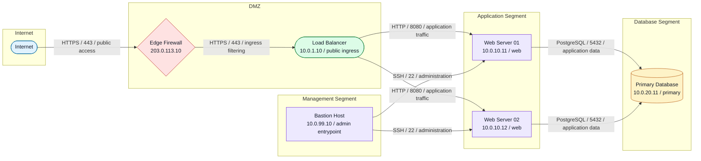

# Web Three Tier Network

## Source

`examples/web-three-tier.yml`

## Summary

- Zones: `5`
- Nodes: `7`
- Connections: `8`

## Mermaid Preview

```mermaid
flowchart LR
  %% Web Three Tier Network
  subgraph zone_internet["Internet"]
    internet(["Internet"])
  end
  subgraph zone_dmz["DMZ"]
    fw01{"Edge Firewall<br/>203.0.113.10"}
    lb01(["Load Balancer<br/>10.0.1.10 / public ingress"])
  end
  subgraph zone_app["Application Segment"]
    web01["Web Server 01<br/>10.0.10.11 / web"]
    web02["Web Server 02<br/>10.0.10.12 / web"]
  end
  subgraph zone_db["Database Segment"]
    db01[("Primary Database<br/>10.0.20.11 / primary")]
  end
  subgraph zone_management["Management Segment"]
    bastion01["Bastion Host<br/>10.0.99.10 / admin entrypoint"]
  end
  internet -->|"HTTPS / 443 / public access"| fw01
  fw01 -->|"HTTPS / 443 / ingress filtering"| lb01
  lb01 -->|"HTTP / 8080 / application traffic"| web01
  lb01 -->|"HTTP / 8080 / application traffic"| web02
  web01 -->|"PostgreSQL / 5432 / application data"| db01
  web02 -->|"PostgreSQL / 5432 / application data"| db01
  bastion01 -->|"SSH / 22 / administration"| web01
  bastion01 -->|"SSH / 22 / administration"| web02
  classDef type_database fill:#fef3c7,stroke:#b45309,color:#111827
  classDef type_external fill:#e0f2fe,stroke:#0369a1,color:#111827
  classDef type_firewall fill:#fee2e2,stroke:#b91c1c,color:#111827
  classDef type_load_balancer fill:#dcfce7,stroke:#15803d,color:#111827
  classDef type_server fill:#ede9fe,stroke:#6d28d9,color:#111827
  class db01 type_database
  class internet type_external
  class fw01 type_firewall
  class lb01 type_load_balancer
  class web01,web02,bastion01 type_server
```
