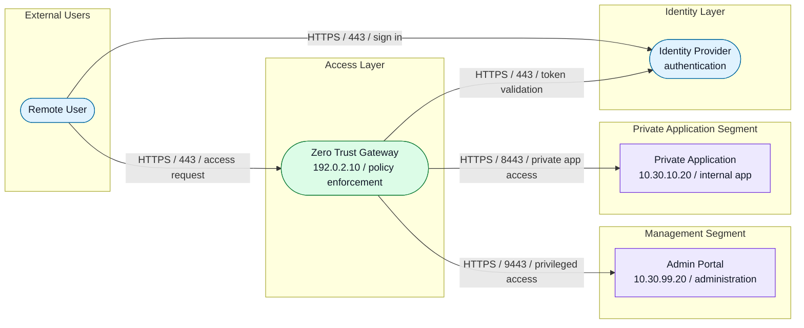

# Zero Trust Access

## Source

`examples/zero-trust-access.yml`

## Summary

- Zones: `5`
- Nodes: `5`
- Connections: `5`

## Mermaid Preview

```mermaid
flowchart LR
  %% Zero Trust Access
  subgraph zone_users["External Users"]
    user(["Remote User"])
  end
  subgraph zone_identity["Identity Layer"]
    idp(["Identity Provider<br/>authentication"])
  end
  subgraph zone_access["Access Layer"]
    zt_gateway(["Zero Trust Gateway<br/>192.0.2.10 / policy enforcement"])
  end
  subgraph zone_private_app["Private Application Segment"]
    app01["Private Application<br/>10.30.10.20 / internal app"]
  end
  subgraph zone_management["Management Segment"]
    admin_portal["Admin Portal<br/>10.30.99.20 / administration"]
  end
  user -->|"HTTPS / 443 / sign in"| idp
  user -->|"HTTPS / 443 / access request"| zt_gateway
  zt_gateway -->|"HTTPS / 443 / token validation"| idp
  zt_gateway -->|"HTTPS / 8443 / private app access"| app01
  zt_gateway -->|"HTTPS / 9443 / privileged access"| admin_portal
  classDef type_external fill:#e0f2fe,stroke:#0369a1,color:#111827
  classDef type_load_balancer fill:#dcfce7,stroke:#15803d,color:#111827
  classDef type_server fill:#ede9fe,stroke:#6d28d9,color:#111827
  class user,idp type_external
  class zt_gateway type_load_balancer
  class app01,admin_portal type_server
```
